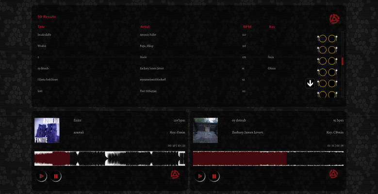

# Build My Crate

This project is a web-based DJ interface that allows a user to find songs online using
search parameters such as tempo and key signature. Two tracks can be
loaded and mixed together.

The front-end is a combination of React, Redux, React-Router, and jQuery. The front-end packages are managed by npm and built by webpack. This build is then served on the Rails 5 asset pipeline. After rendering the layout, Rails functions as an API server for the React app, the root of which can be found at:
[/app/react/](https://github.com/drewmoore/buildmycrate/tree/master/app/react)

Continuous integration testing is accomplished with Travis, RSpec, Jest, and Enzyme. Front-end tests are added to Rails' `rake` test runner.

Music is served from Soundcloud, and I hope to add more providers in future developments. Users can purchase and download tracks that have been licensed by their content owners to do so.

## Wishlist
- Search tracks on multiple providers
  - Perform searches either concurrently, or respond with the results of those searches as they complete via a websocket.
- Allow registering users and saving selected tracks to a "Crate".
  - Allow index component for tracks to list either API results or tracks saved to crate.
- Turntable controls for:
  - Tempo (bpm)
  - Volume
  - "Scratching"
  - Mute
  - Solo
- Social sharing of mixes
